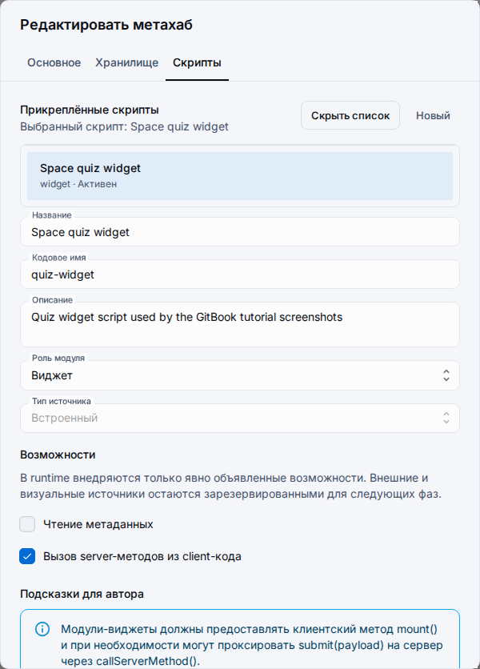

# Области скриптов

Скрипты метахаба используют единый контракт манифеста, но область привязки определяет, где может находиться скрипт и как он применяется.
Сначала выбирайте область, а затем совместимую роль модуля и поведение в рантайме.

## Матрица областей

| Область | Разрешённые роли | Прямой рантайм-вход | Типичное использование |
| --- | --- | --- | --- |
| `general` | только `library` | Нет | Общие вспомогательные модули рабочего пространства ресурсов, импортируемые через `@shared/<codename>`. |
| `metahub` | `module`, `lifecycle`, `widget` | Да | Рантайм-логика и виджеты на уровне метахаба. |
| `hub` / `object` / `set` / `enumeration` / `component` | `module`, `lifecycle`, `widget` | Да | Потребительские скрипты, привязанные к одному объекту проектирования. |

## Правила выбора

- Выбирайте `general/library`, когда код должен переиспользоваться и импортироваться другими скриптами.
- Выбирайте исполняемые области, когда скрипт должен прикрепляться к метахабу или одному объекту и участвовать в рантайм-доставке.
- Не используйте декораторы и доступ к рантайм-контексту внутри кода `library`.
- Публикуйте и синхронизируйте приложение перед проверкой поведения выбранного потребительского скрипта в связанном приложении.

## Что читать дальше

- [Общие скрипты](shared-scripts.md)
- [Скрипты метахаба](scripts.md)
- [Руководство по скриптам метахаба](../../guides/metahub-scripting.md)
- [Система скриптов](../../architecture/scripting-system.md)
