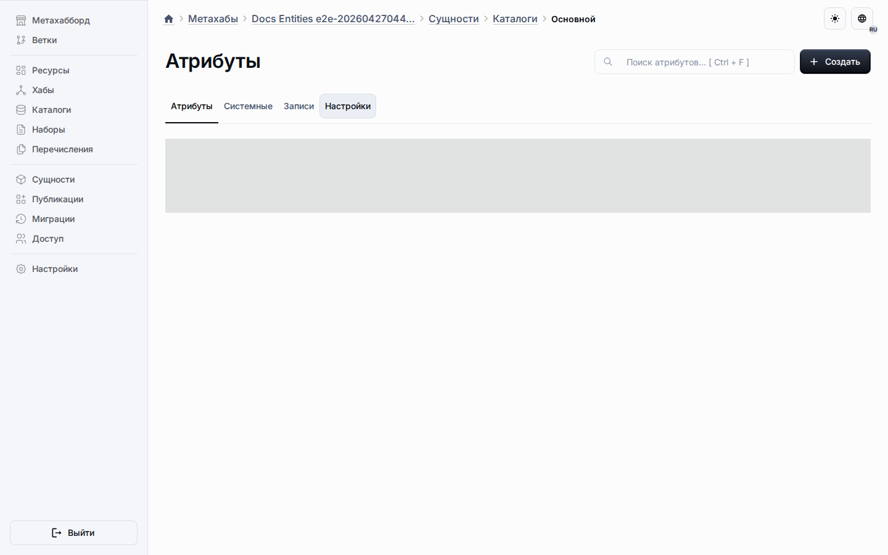

# Общие компоненты

Общие компоненты живут на вкладке «Компоненты» в рабочем пространстве ресурсов и принадлежат виртуальному общему пулу объектов, а не строке одного объекта.
Это позволяет одному определению компонента распространяться на несколько типов сущностей с `dataSchema` без копирования исходной строки проектирования.

Целевые экземпляры объектов показывают список унаследованных компонентов через ту же модель маршрутов, принадлежащих сущностям.

## Правила проектирования

- Создавайте компонент из вкладки «Компоненты», когда он должен появляться более чем в одном объекте или пользовательском типе сущности с той же возможностью.
- Храните поведение компонента в настройках самой сущности, а точечные изменения для целевых объектов — в строках переопределений.
- Используйте целевые объекты только для проверки итогового унаследованного результата, а не для прямого редактирования общей конфигурации.
- Оставляйте локальные компоненты внутри маршрута конкретного объекта, когда наследование не требуется.

## Управление на стороне целевых объектов

- Исключения скрывают общий компонент в выбранных целевых объектах без удаления базовой строки.
- Переопределения активности могут отключать компонент для целевого объекта, если общее поведение разрешает деактивацию.
- Переопределения позиции могут переставлять унаследованную строку только тогда, когда общее поведение это позволяет.
- Списки целевых объектов показывают объединённое унаследованное состояние и оставляют общие строки только для чтения.

## Публикация и runtime

Публикация сохраняет общие компоненты как полноценные общие разделы в проектном snapshot.
Синхронизация приложения разворачивает их в обычные runtime-метаданные полей, чтобы runtime-таблицы оставались плоскими и предсказуемыми.

## Что читать дальше

- [Исключения](exclusions.md)
- [Настройки общего поведения](shared-behavior-settings.md)
- [Рабочее пространство ресурсов](common-section.md)
- [Метахабы](../metahubs.md)
