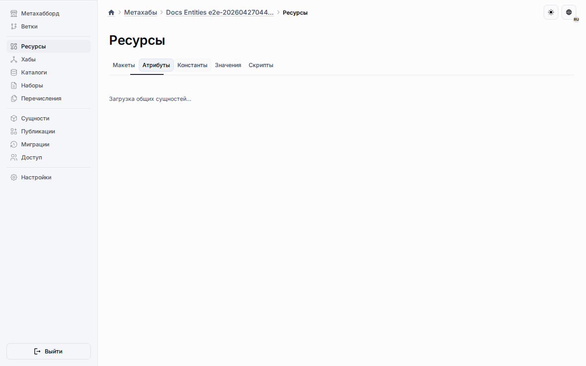
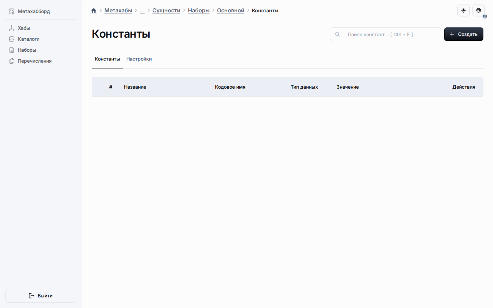

# Общие константы

Общие константы живут на вкладке «Константы» в рабочем пространстве ресурсов и принадлежат виртуальному общему пулу наборов, а не одному конкретному набору.
Это позволяет хранить одно определение константы в центральной точке, пока несколько типов сущностей с `fixedValues` наследуют один источник проектирования.

Целевые экземпляры наборов показывают унаследованные и локальные константы в сфокусированном представлении фиксированных значений.

## Правила проектирования

- Создавайте константу из вкладки «Константы», когда её должны переиспользовать несколько наборов или типов сущностей с `fixedValues`.
- Храните общее поведение на самой константе, а точечные изменения для целевых объектов — в строках переопределений.
- Проверяйте унаследованное состояние из маршрута целевого объекта, но редактируйте базовую общую строку из вкладки «Константы».
- Используйте локальные константы только тогда, когда значение не должно распространяться на другие целевые объекты.

## Управление на стороне целевых объектов

- Исключения убирают унаследованную константу из выбранных целевых объектов без удаления общего источника.
- Переопределения активности отключают константу для целевого объекта только тогда, когда это разрешает общее поведение.
- Переопределения позиции переставляют унаследованную константу только тогда, когда общее поведение не заблокировано.
- Списки целевых объектов показывают объединённое унаследованное состояние и оставляют общие константы только для чтения.

## Публикация и runtime

Публикация экспортирует общие константы в отдельный раздел snapshot.
Runtime продолжает использовать существующий путь для snapshot-констант и `setConstantRef`, не вводя дополнительную runtime-таблицу.

## Что читать дальше

- [Исключения](exclusions.md)
- [Настройки общего поведения](shared-behavior-settings.md)
- [Рабочее пространство ресурсов](common-section.md)
- [Метахабы](../metahubs.md)
