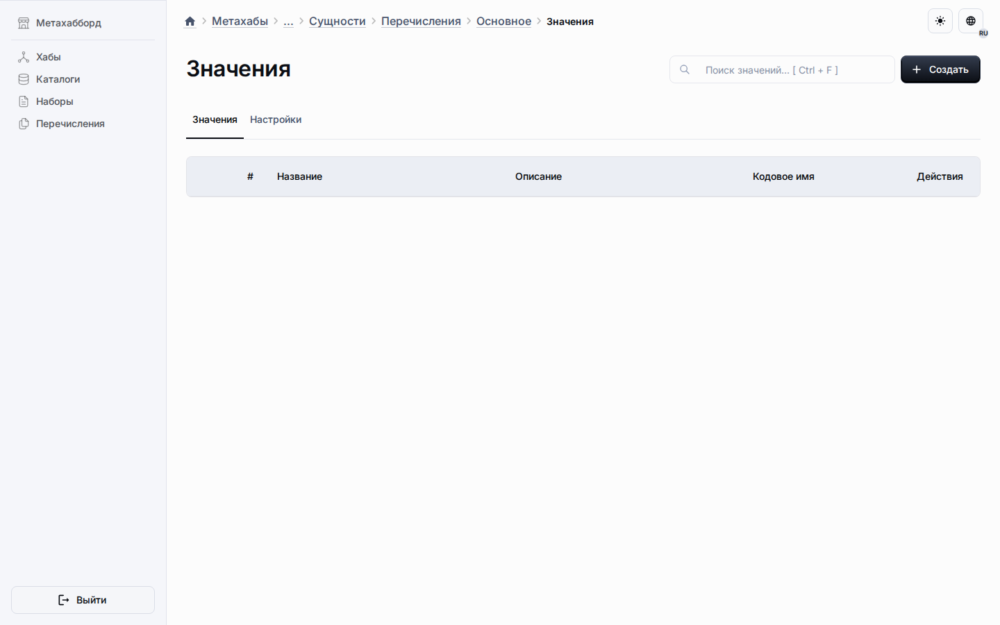

# Общие значения

Общие значения живут на вкладке «Значения» в рабочем пространстве ресурсов и принадлежат виртуальному общему пулу перечислений, а не одному конкретному перечислению.
Это позволяет одному значению оставаться переиспользуемым, пока несколько типов сущностей с `optionValues` наследуют одну исходную строку.

Целевые экземпляры перечислений показывают унаследованные и локальные значения в сфокусированном представлении вариантов.

## Правила проектирования

- Создавайте значение из вкладки «Значения», когда один и тот же смысл должен появляться более чем в одном перечислении или типе сущности с `optionValues`.
- Храните общее поведение на общей строке, а точечные изменения для целевых объектов — в строках переопределений.
- Используйте целевые перечисления для проверки унаследованного состояния, но базовый поток редактирования оставляйте на вкладке «Значения».
- Используйте локальные значения перечисления только тогда, когда значение нужно одному перечислению без наследования другими объектами.

## Управление на стороне целевых объектов

- Исключения скрывают унаследованное значение в выбранных целевых объектах без удаления общего источника.
- Переопределения активности отключают унаследованное значение только тогда, когда это разрешает общее поведение.
- Переопределения позиции переставляют унаследованное значение только тогда, когда общее поведение не заблокировано.
- Списки целевых объектов показывают объединённый унаследованный результат и оставляют общие значения только для чтения.

## Публикация и runtime

Публикация экспортирует общие значения в отдельный раздел snapshot.
Runtime нормализует дублирующиеся идентификаторы унаследованных значений по целевому перечислению, чтобы runtime-метаданные и seeded-ссылки оставались детерминированными.

## Что читать дальше

- [Исключения](exclusions.md)
- [Настройки общего поведения](shared-behavior-settings.md)
- [Рабочее пространство ресурсов](common-section.md)
- [Метахабы](../metahubs.md)
