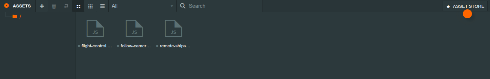
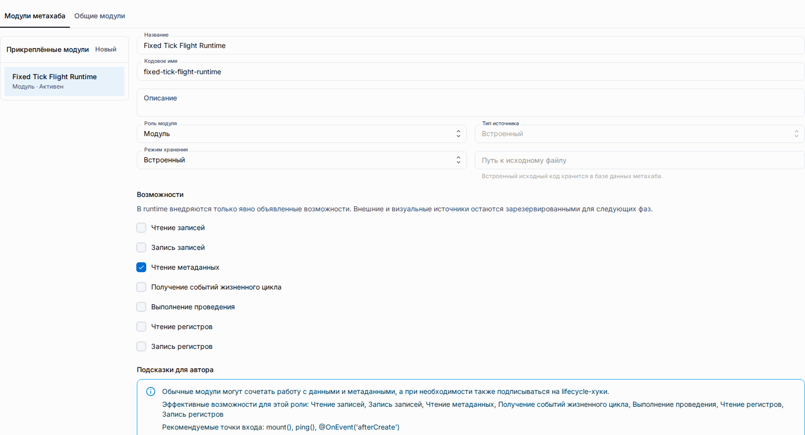

# Ассеты PlayCanvas Editor

Панель ассетов PlayCanvas Editor работает через compatibility-поверхность
проекта метахаба. Она поддерживает ограниченный аутентифицированный процесс
для папок, текстовых файлов, metadata, атрибутов скриптов и опубликованных
скриптовых артефактов.

## Модель ассета

-   Summary ассета содержит идентификатор документа Editor, название, тип, числовой путь, идентификатор родителя и время создания. Внутренняя строка проекта по-прежнему имеет UUID v7 и не используется как обычный пользовательский идентификатор.
-   Папки являются обычными строками ассетов. Их иерархия выводится из `virtualPath`, поэтому создание папки не добавляет миграцию схемы или отдельную структуру DDL.
-   Metadata документа Editor хранит вместе с файловой ссылкой и флагом публикации значения `data`, `meta`, `tags`, `preload`, `source` и `createdAt`.
-   Каждая операция ограничена выбранными метахабом и проектом и требует текущего права управления метахабом. Локальные пути хранения не показываются браузеру.

## Поддерживаемые типы

| Тип                                              | Хранение           | Поведение                                                                                  |
| ------------------------------------------------ | ------------------ | ------------------------------------------------------------------------------------------ |
| `folder`                                         | Строка metadata    | Создаёт узел дерева и может содержать дочерние ассеты.                                     |
| `script`                                         | Файл               | Принимает `.js` или `.mjs`; разобранные атрибуты отражаются в записи скриптового ассета.   |
| `json`, `css`, `html`, `text`, `shader`          | Файл               | Сохраняет содержимое UTF-8 со значением MIME для типа.                                     |
| `material`, `texture`, `model`, `audio`, `other` | Только metadata    | Сохраняет metadata Editor, не заявляя наличие преобразования или поставки бинарных данных. |
| `scene`, `generatedScript`                       | Управляемые записи | Создаются потоками сцен и публикации, а не обычной загрузкой файла.                        |

## Создание и удаление

1. Откройте подключённый проект PlayCanvas и выберите папку назначения в панели ассетов.
2. Используйте действие **+**. Compatibility backend принимает один multipart-файл, ограниченные поля и JSON-значения `data`/`meta`. Файл ограничен 5 MiB и разрешённым списком расширений и MIME.
3. Ответ создания сохраняет upstream-форму `{id}`. Затем bridge обновляет дерево и получает messenger-событие `asset.new` для нового документа.
4. Удаление папки удаляет папку и её потомков. Операция возвращает `204` только после подтверждённого удаления строк и файлов выбранного проекта; недействительные и неизвестные цели обрабатываются закрыто.

Bridge перенаправляет запросы Editor на создание, удаление, чтение исходного
файла и неподдерживаемую перезапись в ограниченное compatibility-пространство.
Неподдерживаемая перезапись `PUT /assets/:id` и неизвестные вызовы ассетов
возвращают типизированные JSON-ошибки, а не HTML-запасной маршрут приложения.

Граница копирования этого среза — копирование метахаба: оно клонирует строки
проектов и локальное дерево файлов, затем remaps локальные идентификаторы и
корни проектов. Панель ассетов не предоставляет клонирование отдельного
ассета и не копирует историю операций ShareDB или совместные сессии. При
копировании доступа исходный владелец метахаба становится администратором
нового метахаба; единственным владельцем остаётся пользователь, выполнивший копирование.

## Скриптовые ассеты и атрибуты

Ассеты Editor `.js` и `.mjs` разбираются worker-ом Editor. Realtime-фрейм
`pipeline` сохраняет разобранные атрибуты и состояние загрузки в документе
ассета, отражает их в строке `_mhb_playcanvas_script_assets` и отправляет
messenger-событие `scriptAttrsFinished:<job>`. Backend не выполняет и не
разбирает произвольный JavaScript в пути запроса.

Во время публикации готовый исходный скрипт проверяется по checksum и
компилируется в ESM-артефакт. `playcanvas` остаётся внешним импортом для
import map документа; импорты библиотек `@shared/<codename>` встраиваются в
порядке зависимостей, а любой другой bare import отклоняется. Опубликованный
manifest содержит `scriptName`, определения атрибутов, связанные значения
атрибутов, целевой `sceneEntityStableId`, URL артефакта и его шестнадцатеричный
`artifactHash` в нижнем регистре.

Runtime-loader запрашивает каждый артефакт без кэша, проверяет его SHA-256,
создаёт из него Blob с MIME `text/javascript`, импортирует в main thread,
регистрирует экспортированный класс в реестре скриптов приложения и прикрепляет
его к соответствующей сущности сцены. На canvas появляется
`data-scripts-loaded` со значением `true`, `failed` или `none`; ошибка проверки
или отсутствие сущности не позволяет запустить рантайм.

## Правила папок и путей

-   Для дочернего ассета нужно указать существующую родительскую папку. Имена папок и файлов не могут содержать скрытые сегменты, переходы к родителю, разделители путей или NUL.
-   Файлы хранятся под namespace `assets` выбранного проекта. Физические ссылки на файлы остаются на сервере и проверяются для выбранного проекта перед чтением.
-   Идентификаторы документов папок детерминированы путём проекта, а постоянные строки metadata по-прежнему используют UUID v7. Это сохраняет дерево при повторной генерации и не делает вычисленный идентификатор Editor первичным ключом базы.
-   Текущая поверхность принимает только небольшие текстовые и графические файлы. Преобразование моделей, аудио и текстур или произвольные пути загрузки бинарных данных не выполняются.

## Ограничения

-   Compatibility boundary использует single-user ShareDB-compatible snapshots; это не parity с PlayCanvas Cloud и не история совместных операций.
-   Обработка бинарных данных, S3-провайдеры, cloud build jobs, документы исходников code editor и широкие pipeline-ы импорта ассетов остаются за пределами этого среза.
-   Multipart-перезапись намеренно не поддерживается (`501` JSON). Изменение полей продолжает идти через существующий путь ShareDB-документа.
-   Поддерживаемый content view — аутентифицированный raw file endpoint, используемый парсером Editor. Полные документы Code Editor и редактируемая история исходников находятся за пределами этого среза.
-   Runtime-артефакты — неизменяемые опубликованные data URL с checksum. Изменяемые authoring paths и локальные файловые расположения не попадают в runtime manifest.

На странице «Ресурсы» теперь отображается одна вкладка «Модули» с
локализованным переключателем области: модули метахаба и общие модули.

Процесс работы с ассетами сохраняет текущие версии схемы проекта и шаблона
метахаба. Папки являются производными данными, а не новой версией схемы.

## Связанные материалы

-   [Пакет PlayCanvas Editor](./playcanvas-editor.md) — запуск iframe, безопасность bridge и границы пакета.
-   [Проекты PlayCanvas](./playcanvas-projects.md) — хранение проектов, снимки и manifests публикации.
-   [Общие модули](./metahubs/shared-modules.md) — переиспользуемые библиотеки `@shared/<codename>` для компиляции скриптов.
