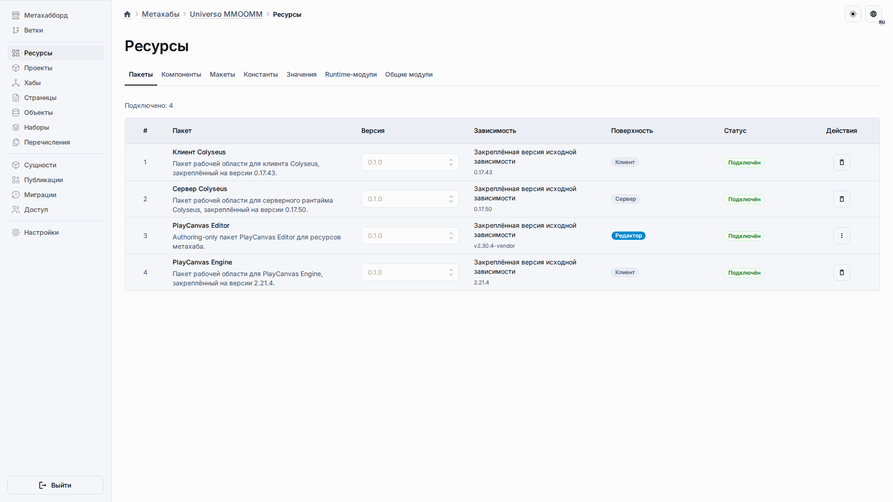
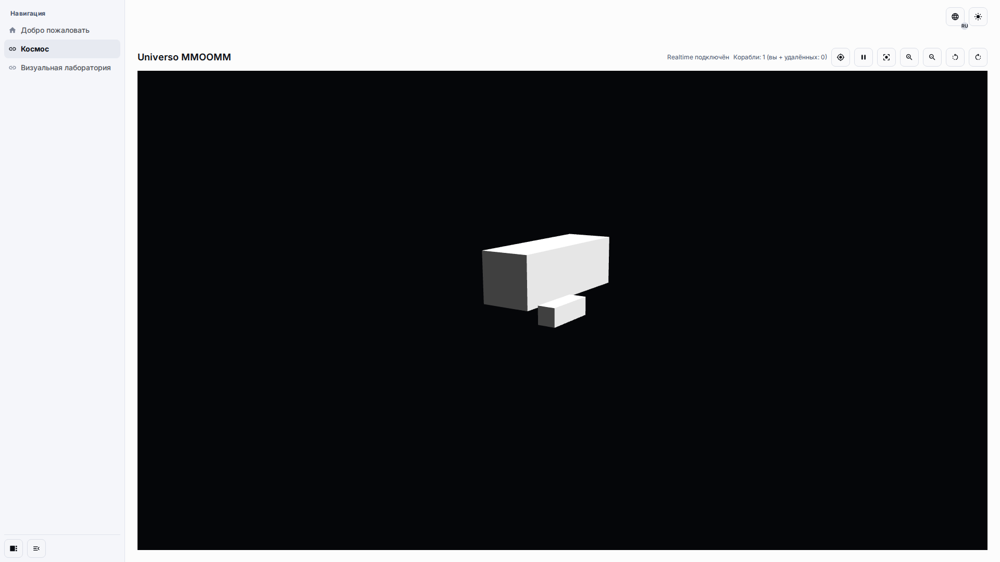
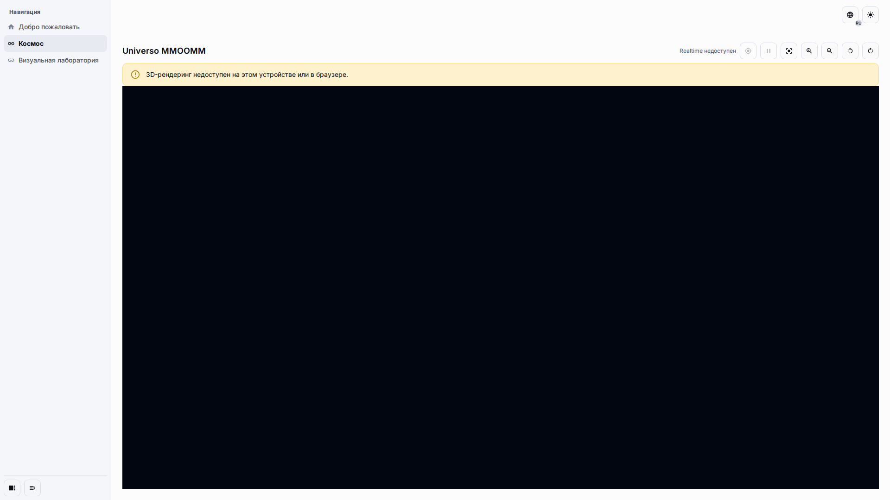
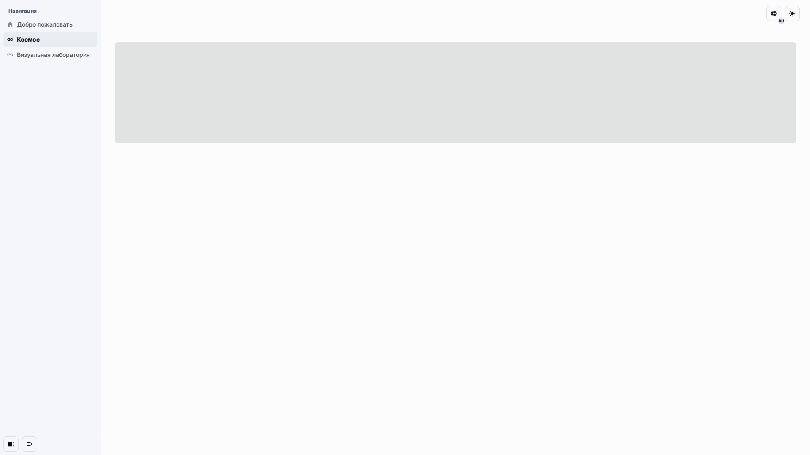

# PlayCanvas Editor v2.30.4 — матрица совместимости Universo

Область действия: upstream PlayCanvas Editor, вендоризированный на теге
`v2.30.4` (коммит `cf296bcb669bdcb168778bf2979160a9fe8f67de`), в режиме
`universo-full-upstream-ui` внутри `apps-template-mui`. Матрица фиксирует
решения по возможностям (**D4**), на которые опираются шаги плана P5.3/P5.4.

Версия каталога схем: **1** (`PLAYCANVAS_EDITOR_SCHEMA_CATALOG_VERSION = 1`,
генерируется в
`packages/universo-react-playcanvas-editor-backend/src/config/generated-schema-catalog.json`,
документы: `asset`, `scene`, `settings`).

## Константы времени жизни артifact-токена

| Константа                                              | Значение | Смысл                                                                                                                                                                      |
| ------------------------------------------------------ | -------- | -------------------------------------------------------------------------------------------------------------------------------------------------------------------------- |
| `PLAYCANVAS_EDITOR_COMPATIBILITY_TOKEN_TTL_MS` (types) | 5 мин    | TTL access-токена compatibility REST.                                                                                                                                      |
| `artifactTokenTtlMs` (`editorArtifactTokenService.ts`) | 5 мин    | TTL токена подресурсов артефакта, выпускаемого на сессию редактора.                                                                                                        |
| `artifactTokenGraceWindowMs`                           | 5 мин    | Серверное «окно благоприятности»: истёкший токен принимается, пока жива привязанная bridge-сессия, — покрывает in-flight загрузки подресурсов, соревнующиеся с продлением. |
| `artifactTokenAbsoluteTtlMs`                           | 12 ч     | Абсолютный потолок от исходного `issuedAt`; продления сдвигают короткий TTL, но не могут продлить суммарный срок жизни токена за этот предел.                              |

## Варианты страниц (P5.3)

Full-boot конфиг несёт обязательный, проверяемый Zod дескриптор `pages`
(`playCanvasEditorFullBootPagesDescriptorSchema` в
`packages/universo-react-types/src/common/playcanvasEditorCompatibility.ts`):

| Ключ                 | Вариант                  | Reason key                                 |
| -------------------- | ------------------------ | ------------------------------------------ |
| `fullEditor`         | `{ kind: 'fullEditor' }` | —                                          |
| `codeEditor`         | unavailable              | `shareDbDocumentsCollectionNotImplemented` |
| `launchPage`         | unavailable              | `launchSurfaceDeferred`                    |
| `blankProjectPicker` | unavailable              | `sessionsAreProjectPinned`                 |
| `fontImport`         | unavailable              | `fontGenerationWorkerStubbed`              |

Правила fail-closed:

-   Бэкенд всегда заполняет `pages`; конфиги без дескриптора отклоняются схемой
    (строгий переход задокументирован тестом в
    `packages/universo-react-types/src/__tests__/playcanvasEditorBridge.test.ts`).
-   Хост-страница повторно валидирует дескриптор через
    `playCanvasEditorFullBootPagesDescriptorSchema.safeParse` и при расхождении
    показывает существующий локализованный Alert вместо запуска редактора.
-   Bootstrap артефакта (`assertFullBootConfig` в
    `packages/universo-react-playcanvas-editor-frontend/scripts/lib/playcanvas-editor-artifact.mjs`)
    отказывается запускать UI, если дескрипторы `pages.fullEditor`,
    `codeEditor` или `launchPage` отсутствуют или противоречат D4.
-   `url.launch` указывает на внутренний плейсхолдер `/universo-surface-unavailable`
    (`PLAYCANVAS_EDITOR_SURFACE_UNAVAILABLE_PATH`). Значение сознательно НЕ
    содержит литерал `/disabled`: действующее правило Zod, запрещающее
    `/disabled` в full-boot URL, сохранено без изменений (теперь применяется и к
    `url.launch`), а защита артефакта от `/disabled` realtime-эндпоинтов не тронута.

## Матрица поверхностей (P5.4)

| Поверхность                                                                    | Вердикт                          | Поведение для пользователя                                                                                                                                                                                                                          | Механизм принуждения / файл                                                                                                                                                                                                   |
| ------------------------------------------------------------------------------ | -------------------------------- | --------------------------------------------------------------------------------------------------------------------------------------------------------------------------------------------------------------------------------------------------- | ----------------------------------------------------------------------------------------------------------------------------------------------------------------------------------------------------------------------------- |
| Оболочка основного редактора (граф сцены, иерархия, инспектор, панель ассетов) | Поддерживается                   | Полный upstream UI запускается с привязкой к проекту; сохранение сцен и ассеты идут через compatibility REST + ShareDB мост.                                                                                                                        | `packages/universo-react-playcanvas-editor-backend/src/routes/index.ts`; bootstrap-мост `writeBridgeBootstrap`                                                                                                                |
| Пикер пустых/CMS-проектов (`picker-project-main`, управление проектами)        | Отложено                         | Сессии всегда привязаны к одному проекту метахаба; попытки переключить/создать проект отклоняются локализованным сообщением.                                                                                                                        | Дескриптор `pages.blankProjectPicker` (D4); ключ хоста `packages.editorHost.blankPickerUnavailable` в `metahubs.json` (en/ru)                                                                                                 |
| Редактор кода (`/editor/code/:projectId`, IDE sourcefiles)                     | Намеренно отключён               | Deep link из тулбара перехватывается до навигации; пользователь видит локализованное предупреждение вместо raw 404 или сломанной IDE. Коллекция ShareDB `documents` НЕ реализована; белый список коллекций — `scenes\|assets\|settings\|user_data`. | Guard `window.open` → `UniversoSurfaceGuardedOpen` в `writeBridgeBootstrap` (библиотека артефакта, не vendor); дескриптор протокола `documents.codeEditorSourcefiles`; ключ хоста `packages.editorHost.codeEditorUnavailable` |
| Страница запуска (предпросмотр сцены вне редактора)                            | Отложено / скрыта                | Цели навигации запуска указывают на `/universo-surface-unavailable*`; guard блокирует окно и сообщает хосту; показывается локализованное предупреждение.                                                                                            | Sentinel `url.launch` из `createPlayCanvasEditorFullBootConfig`; тот же guard `window.open`; ключ хоста `packages.editorHost.launchUnavailable`                                                                               |
| Импорт шрифтов (worker генерации шрифтов)                                      | Скрыт / fail-closed              | Действия импорта завершаются ошибкой закрытия: worker генерации шрифтов заглушен и выбрасывает исключение, частичный шрифтовой ассет невозможен. Скрытие через хирургию vendor не применялось (см. примечание ниже).                                | Заглушенный worker в конвейере сборки vendor; дескриптор `pages.fontImport`; ключ хоста `packages.editorHost.fontsUnavailable` при попытке                                                                                    |
| Интеграция MCP                                                                 | Вне области                      | Не поставляется; расширения CSP под MCP-эндпоинты нет.                                                                                                                                                                                              | Исключено из выбора vendor-сборки; маршруты не регистрируются                                                                                                                                                                 |
| Контроль версий (ветки/чекпоинты)                                              | Отложено (cloud-only)            | Панели VCS работают с облачными API, которые заменены no-op заглушками.                                                                                                                                                                             | Дескриптор `cloudOnly.branchesCheckpoints`; ответы `createCloudOnlyNoOp`                                                                                                                                                      |
| Сборка и публикация                                                            | Отложено (cloud-only)            | Диалоги публикации обращаются к заглушенным cloud-only эндпоинтам и получают структурные no-op ответы.                                                                                                                                              | Дескрипторы `cloudOnly.publishing` / `cloudOnly.jobs`; статусы через `packages.editorHost.*`                                                                                                                                  |
| Store / конвейер ассетов / пользователи совместной работы                      | Отложено (cloud-only)            | Тот же контракт заглушенных no-op ответов.                                                                                                                                                                                                          | Дескрипторы `cloudOnly.store` / `assetPipeline` / `usersCollaboration`                                                                                                                                                        |
| Коллекции ShareDB `scenes`, `assets`, `settings`, `user_data`                  | Поддерживаются (в рамках сессии) | Сохраняются через document-op/snapshot порт с хранилищем проектов метахаба.                                                                                                                                                                         | Кортеж `shareDb.requiredCollections` в дескрипторе протокола full-boot                                                                                                                                                        |
| Коллекция ShareDB `documents`                                                  | Явно запрещена                   | Любая попытка синхронизации документов исходников редактора кода отклоняется; существуют только четыре разрешённые коллекции.                                                                                                                       | `documents.codeEditorSourcefiles: { status: 'disabled', ... }` в дескрипторе протокола; белый список ShareDB в realtime runtime                                                                                               |

## Примечание отчёта: решение по слою патчей

Скрытие действия импорта шрифтов и пунктов меню пикеров внутри собранного
upstream-бандла потребовало бы DOM-хирургии по нестабильным PCUI-классам,
генерируемым на этапе сборки. По P5.4(c) выбран безопасный путь со строковыми
контрактами: bootstrap-мост перехватывает `window.open` (наш собственный скрипт,
нулевые правки vendor), а каждая недоступная поверхность дополнительно
закрывается через типизированный дескриптор и локализованные Alerts хоста.

## Визуальное подтверждение

Рабочее пространство v2.30.4 в матрице вьюпортов (standalone-загрузка артефакта,
см. `docs:playcanvas-editor-upgrade:screenshots`). RU-снимки — `pending` в
provenance-манифесте до появления локализованного хост-флоу; ниже — EN-интерфейс:

## Кадры релиза

Кадры релиза обновлённого набора пакетов, снятые в фиксированном десктопном
вьюпорте 1920×1080 на обоих языках (EN и RU) командой
`docs:playcanvas-editor-upgrade:release-screenshots`: страница «Ресурсы»
метахаба с четырьмя подключёнными пакетами, опубликованное MMOOMM-приложение
с отрисованным канвасом runtime, локализованное терминальное состояние при
недоступном WebGL2 и кадр скелета ленивой загрузки.

