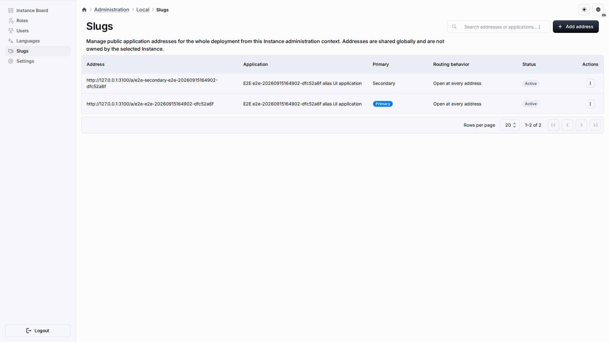

# Публичные приложения и адреса

Приложение может показывать опубликованную маркетинговую страницу неавторизованным посетителям. Публичный вход разрешается по неизменяемому UUID приложения или по глобальному алиасу:

```text
/a/<uuid-приложения>
/a/<алиас>
```



UUID остаётся стабильным техническим адресом. Алиас — изменяемое имя маршрута в нижнем регистре длиной не более 63 символов. В алиасах запрещены слеши, percent-escape, управляющие символы, не-ASCII символы, зарезервированные слова маршрутов и значения, похожие на UUID.

## Граница публичного рантайма

Браузер обращается к отдельному публичному endpoint:

```text
GET /api/v1/public/applications/:applicationRef/runtime?locale=en|ru
```

Запрос отправляется без credentials. Сервер разрешает UUID или алиас, проверяет публичность и публикацию приложения, согласованность установленного рантайма и возвращает allowlist DTO для renderer. Неизвестное, приватное, архивное или неготовое приложение получает одинаковый ответ недоступности, поэтому маршрут не раскрывает состояние приложения. Публичный запрос никогда не выбирает рабочее пространство и не принимает `workspaceId` как разрешение.

Анонимная навигация сохраняет тот же неинформативный контракт: любой адрес, который не является готовым публичным приложением, ведёт на страницу входа — единообразно для закрытых, неизвестных, архивных, неопубликованных и неготовых адресов. Перенаправление не зависит от конкретной приватной причины, поэтому по нему нельзя определить существование закрытого приложения. Авторизованные администраторы продолжают идти обычным путём членства и guard-проверок.

Защищённая панель управления остаётся на административном маршруте приложения. Публичная ссылка не открывает анонимный CRUD, мутации рантайма, коннекторы, участников или неопубликованные настройки. Действия маркетингового рантайма ограничены опубликованным контрактом чтения.

## Управление адресами

Пользователь с разрешением `applicationAliases` может открыть **Администрирование → Экземпляр → Слаги** (адреса приложений). Корневой **Superuser** получает доступ через существующий bypass суперпользователя; новая роль `Superadmin` не создаётся. Это же разрешение назначается существующим ролям и новым пользовательским ролям через обычные правила управления разрешениями.

В редакторе приложения появляется вкладка **Адреса**, если у администратора есть соответствующее разрешение. В ней видны технический UUID-адрес, активные алиасы и политика маршрутизации, а также действия создания, переименования, выбора основного адреса и освобождения алиаса. На центральной странице экземпляра доступны те же операции для всех приложений; при создании используется выбор приложения, а не ручной ввод UUID.

Алиасы глобальны для развёртывания и остаются зарезервированными, пока явно не освобождены, в том числе после архивации приложения. Уникальный индекс базы данных и транзакционная блокировка на приложение защищают создание, переименование, смену основного адреса, освобождение и изменение политики при конкурентных запросах.

Доступны две политики:

| Политика           | Поведение                                                                                                                               |
| ------------------ | --------------------------------------------------------------------------------------------------------------------------------------- |
| Прямой доступ      | Каждый активный алиас открывает рантайм приложения.                                                                                     |
| Канонический адрес | Основной алиас является публичным адресом; остальные активные алиасы перенаправляют на него с сохранением суффикса пути и query string. |

Стабильный UUID-адрес работает при обеих политиках. Каноникализация выполняется через same-origin SPA-навигацию с заменой записи истории, поэтому изменяемый алиас не создаёт постоянный внешний redirect.

## Виджет изображения маркетинговой страницы

Макет `marketing-page` владеет центральным изображением первого экрана через типизированный виджет `marketing.image`. Его редактор использует существующий диалог настройки макета и показывает рекомендации по широкому формату 16:9, ориентировочному размеру 1600×900, форматам WebP/JPEG/PNG и требованию HTTPS URL. Первая версия принимает только ссылку на изображение; загрузка, обрезка, обработка и генерация изображения в задачу не входят.

Встроенный шаблон сохраняет ссылку на демонстрационное изображение MUI. Fixture Консорциума «73-й Меридиан» также сохраняет эту ссылку, чтобы после импорта её можно было заменить в настройках макета приложения без изменения продуктового файла.

## Название и логотип бренда

Виджет `marketing.brand` в зоне шапки отвечает за идентичность бренда. В его редакторе доступны **Название бренда** (необязательная обычная подпись для всех локалей) и **URL логотипа бренда** (необязательное декоративное HTTPS-изображение). Логотип отображается и в шапке, и в подвале; если логотип не задан или изображение не загрузилось, показывается название бренда текстом, а демонстрационный вордмарк используется только когда не задано ни то, ни другое. Редакторы задают значения через **Макеты → marketing-page → зона шапки → виджет «Бренд»**; к URL применяются те же правила, что и к центральному виджету изображения, включая требование HTTPS вне локальной разработки.

## Fixture Консорциума «73-й Меридиан»

Продуктовый snapshot создаётся через существующие Playwright API авторинга и экспорта, а не собирается вручную:

```bash
pnpm run test:e2e:73rd-meridian-fixture-gate:local-supabase
```

Контракт проверяет согласованный русский текст из `.backup/Лендинг-для-Консорциума.md` и английский перевод, отсутствие демо-тарифов, выдуманных логотипов, придуманных отзывов и неподтверждённых демо-адресов, наличие утверждённых контактов в подвале (Telegram-канал, почта, телефон), а также отключённые действия lead/auth/newsletter. Сгенерированный snapshot записывается в `tools/fixtures/metahubs-73rd-meridian-app-snapshot.json` для импорта в новую тестовую базу. Контракт сверяет все семантические marketing records в обоих языках. Drift gate сравнивает сгенерированный snapshot с committed fixture после нормализации транспортных ID, hash и timestamp и требует ровно одно вхождение `dashboard.jpg` в hero-ресурсе `marketing.image`. Browser flow импортирует committed fixture, создаёт связанную публичную публикацию и проверяет anonymous runtime по UUID и alias в режимах direct и canonical с сохранением suffix пути и query.
