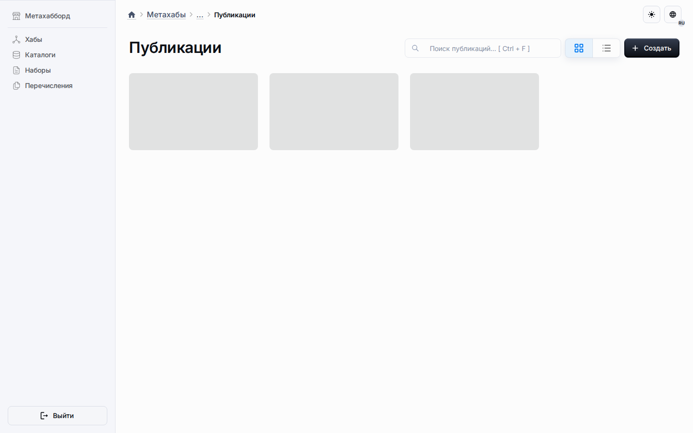
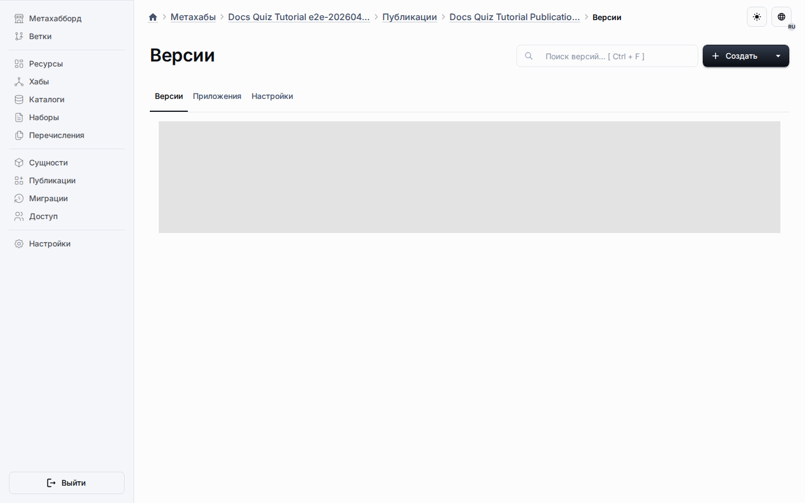
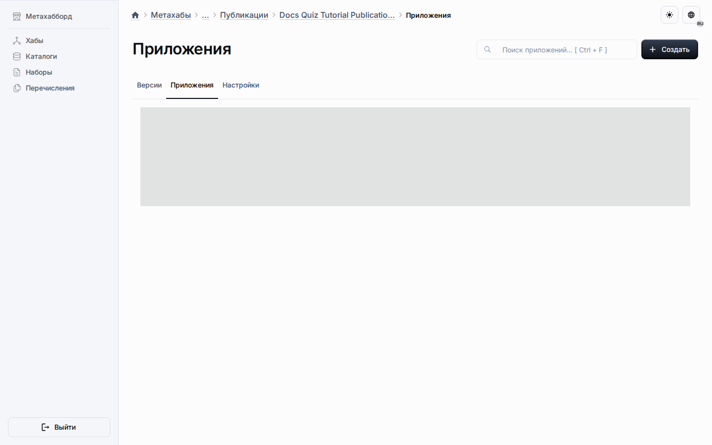

# Публикации

Публикации — это сторона проектных структур, ориентированная на выпуск. Они
позволяют переводить подготовленный контент, определения или связанные с приложениями артефакты из совместных потоков редактирования в распространяемые
рабочие поверхности.

## Текущая реализация

Репозиторий уже включает сущности публикаций, версии, связи с метахабами и
приложениями, управление на уровне маршрутов и связанную логику хранения вместе
с проверками контроля доступа.

## Почему публикации важны

- Они разделяют редактирование и поверхности выпуска.
- Они поддерживают явные версии и контролируемые обновления релизов.
- Они связывают проектные структуры и рабочие приложения.
- Они создают базу для экспорта и синхронизации.

Это одна из базовых возможностей платформы, а не просто механизм обмена контентом.
