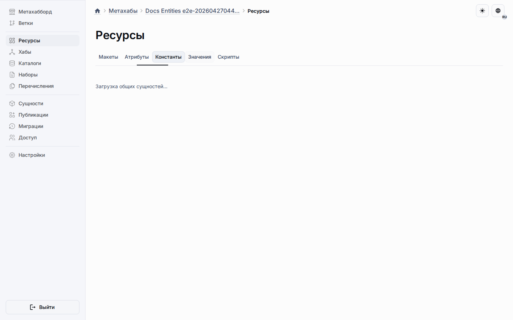

# Узлы данных

Узлы данных несут значения, сопоставления, ссылки и типизированные полезные нагрузки,
которые затем потребляются другими узлами.

## Типичные обязанности

- Хранить структурированные значения или параметры.
- Связывать одну часть модели с другой.
- Делать поток данных явным внутри более крупных графов.

В более широком контексте платформы узлы данных помогают выражать конфигурацию,
промежуточные результаты, экспортируемые определения и полезные нагрузки для интеграций.
