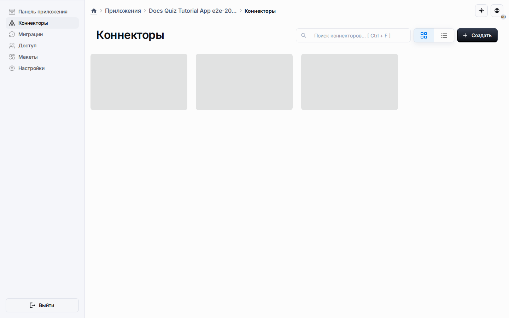

# Узлы событий

Узлы событий представляют триггеры, сигналы и наблюдаемые изменения, на которые
могут реагировать другие части системы.

## Типичные обязанности

- Отмечать, что некоторое событие произошло.
- Развязывать реакции с инициирующей операцией.
- Поддерживать мониторинг, автоматизацию и интеграционные hooks.

Это делает узлы событий важными для публикаций, приложений, аналитики и уведомлений.
