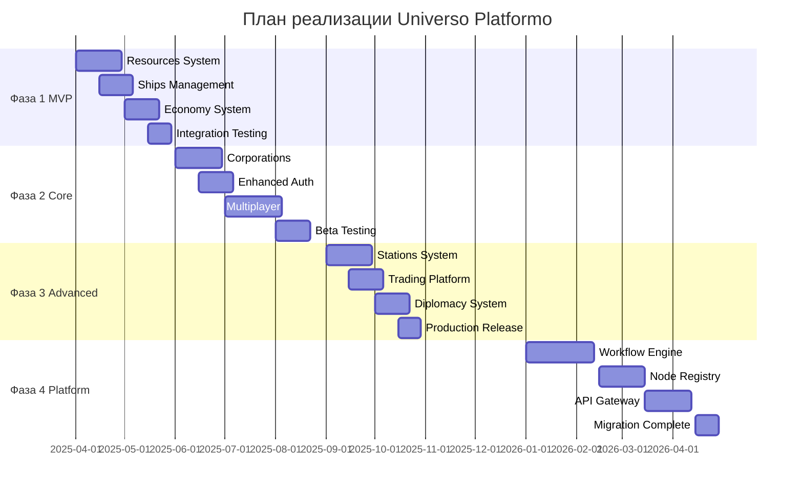
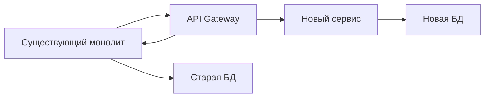
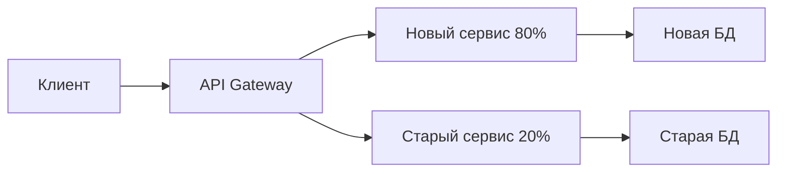
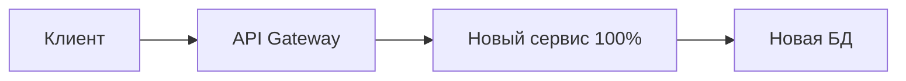

# План реализации Universo Platformo

## Краткое описание

Поэтапный план реализации целевой архитектуры Universo Platformo, разделенный на 4 основные фазы с четкими критериями готовности и временными рамками. План обеспечивает постепенный переход от текущей архитектуры к полнофункциональной микросервисной экосистеме.

## Содержание

- [Обзор плана реализации](#обзор-плана-реализации)
- [Фазы разработки](#фазы-разработки)
- [Стратегия миграции](#стратегия-миграции)
- [Управление рисками](#управление-рисками)
- [Критерии успеха](#критерии-успеха)

## Обзор плана реализации

### Общая стратегия

План реализации следует принципу **постепенной эволюции**, где новые приложения создаются параллельно с существующими, а затем постепенно заменяют старые компоненты. Это обеспечивает:

- **Нулевое время простоя** (zero downtime deployment)
- **Обратную совместимость** с существующими функциями
- **Возможность отката** на предыдущие версии
- **Постепенное обучение команды** новым технологиям

### Временные рамки



### Приоритизация приложений

**Критерии приоритизации**:
1. **Критичность для MVP**: Необходимость для базового функционала
2. **Зависимости**: Количество других приложений, зависящих от данного
3. **Сложность реализации**: Время и ресурсы, необходимые для разработки
4. **Бизнес-ценность**: Влияние на пользовательский опыт

## Фазы разработки

### Фаза 1: MVP Universo MMOOMM (v0.22.0-alpha) - Q2 2025

**Цель**: Создание базового игрового функционала для демонстрации концепции

**Длительность**: 10 недель (апрель - июнь 2025)

**Приоритетные приложения**:

#### 1. Resources System (4 недели)
- **resources-frt**: Интерфейс управления ресурсами
- **resources-srv**: API системы ресурсов с плотностью материалов

**Ключевые функции**:
- 16 типов материалов с реалистичной плотностью
- Система инвентаря с весом/объемом
- Интеграция с существующим MMOOMM шаблоном

#### 2. Ships Management (3 недели)
- **ships-frt**: Интерфейс управления кораблями
- **ships-srv**: API флота и кастомизации

**Ключевые функции**:
- Базовое управление кораблями
- Простая кастомизация и модификации
- Интеграция с системой ресурсов

#### 3. Economy System (3 недели)
- **economy-frt**: Интерфейс экономической системы
- **economy-srv**: API валюты Inmo и торговли

**Ключевые функции**:
- Валюта Inmo между тремя мирами
- Базовые торговые операции
- Динамическое ценообразование

**Критерии готовности Фазы 1**:
- [ ] Работающий MVP с базовыми игровыми механиками
- [ ] Интеграция с существующим PlayCanvas шаблоном
- [ ] Базовая экономика между 3 мирами (Kubio, Konkordo, Triumfo)
- [ ] Система ресурсов с реалистичной физикой
- [ ] Успешное прохождение интеграционных тестов
- [ ] Документация API для всех новых сервисов

### Фаза 2: Базовые системы (v0.25.0-beta) - Q3 2025

**Цель**: Социальные и технические системы для полноценного мультиплеера

**Длительность**: 12 недель (июнь - август 2025)

**Приложения**:

#### 4. Corporations System (4 недели)
- **corporations-frt**: Интерфейс корпораций
- **corporations-srv**: API организаций и ролей

#### 5. Enhanced Authentication (3 недели)
- **auth-enhanced-frt**: Расширенный интерфейс авторизации
- **auth-enhanced-srv**: Интеграция игровых и платформенных аккаунтов

#### 6. Multiplayer System (5 недель)
- **multiplayer-frt**: Интерфейс мультиплеера
- **multiplayer-srv**: Синхронизация в реальном времени

**Критерии готовности Фазы 2**:
- [ ] Полнофункциональная мультиплеерная система
- [ ] Работающие корпорации с базовым управлением
- [ ] Интегрированная система авторизации
- [ ] Beta-качество стабильности
- [ ] Нагрузочное тестирование до 100 одновременных пользователей

### Фаза 3: Продвинутые функции (v1.0.0) - Q4 2025

**Цель**: Полная экосистема игровых механик

**Длительность**: 10 недель (сентябрь - ноябрь 2025)

**Приложения**:

#### 7. Stations System (4 недели)
- **stations-frt**: Интерфейс космических станций
- **stations-srv**: API строительства и производства

#### 8. Trading Platform (3 недели)
- **trading-frt**: Интерфейс торговых операций
- **trading-srv**: API аукционов и контрактов

#### 9. Diplomacy System (3 недели)
- **diplomacy-frt**: Интерфейс дипломатии
- **diplomacy-srv**: API союзов и конфликтов

**Критерии готовности Фазы 3**:
- [ ] Полная экосистема игровых механик
- [ ] Продвинутые социальные функции
- [ ] Production-ready качество
- [ ] Полная документация API
- [ ] Поддержка до 1000 одновременных пользователей

### Фаза 4: Экосистема (v1.5.0+) - 2026+

**Цель**: Микросервисная платформа и рефакторинг Flowise

**Длительность**: 16 недель (январь - апрель 2026)

**Приложения**:

#### 10. Workflow Engine (6 недель)
- **workflow-engine-srv**: Выделение движка Chatflow

#### 11. Node Registry (4 недели)
- **node-registry-srv**: Центральный реестр узлов

#### 12. API Gateway (4 недели)
- **api-gateway-srv**: Единая точка входа

#### 13. Template Engine (2 недели)
- **template-engine-srv**: Система шаблонов экспорта

**Критерии готовности Фазы 4**:
- [ ] Полная микросервисная архитектура
- [ ] Горизонтальное масштабирование
- [ ] Отделение от монолитного Flowise
- [ ] Enterprise-grade надежность

## Стратегия миграции

### Паттерн Strangler Fig

Применяем паттерн **Strangler Fig** для постепенного замещения монолитной архитектуры:

1. **Создание новых сервисов** параллельно с существующими
2. **Постепенное перенаправление** трафика на новые сервисы
3. **Удаление старых компонентов** после полной миграции

### Этапы миграции

#### Этап 1: Создание новых сервисов


#### Этап 2: Перенаправление трафика


#### Этап 3: Полная миграция


### Инструменты миграции

#### Feature Flags
```typescript
interface FeatureFlag {
    name: string;
    enabled: boolean;
    rolloutPercentage: number;
    conditions?: {
        userGroups?: string[];
        regions?: string[];
        timeRange?: {
            start: Date;
            end: Date;
        };
    };
}

// Использование
if (featureFlags.isEnabled('new-resources-system', userId)) {
    return newResourcesService.getResources(userId);
} else {
    return legacyResourcesService.getResources(userId);
}
```

#### Database Migration
```sql
-- Создание новых таблиц
CREATE SCHEMA universo_resources;
CREATE TABLE universo_resources.materials (...);

-- Миграция данных
INSERT INTO universo_resources.materials 
SELECT * FROM legacy.resources_table;

-- Создание представлений для совместимости
CREATE VIEW legacy.resources_table AS 
SELECT * FROM universo_resources.materials;
```

#### API Versioning
```typescript
// v1 API (legacy)
app.get('/api/v1/resources', legacyResourcesController);

// v2 API (new)
app.get('/api/v2/resources', newResourcesController);

// Автоматическое перенаправление
app.get('/api/resources', (req, res, next) => {
    if (featureFlags.isEnabled('new-resources-api', req.user.id)) {
        return newResourcesController(req, res, next);
    } else {
        return legacyResourcesController(req, res, next);
    }
});
```

## Управление рисками

### Технические риски

#### Риск 1: Производительность новых сервисов
**Вероятность**: Средняя
**Влияние**: Высокое
**Митигация**: 
- Нагрузочное тестирование на каждом этапе
- Мониторинг производительности в реальном времени
- Возможность быстрого отката на предыдущую версию

#### Риск 2: Сложность интеграции
**Вероятность**: Высокая
**Влияние**: Среднее
**Митигация**:
- Детальное проектирование API контрактов
- Автоматизированное тестирование интеграций
- Постепенное внедрение с малыми итерациями

#### Риск 3: Потеря данных при миграции
**Вероятность**: Низкая
**Влияние**: Критическое
**Митигация**:
- Полное резервное копирование перед миграцией
- Тестирование миграции на копии продакшн данных
- Поэтапная миграция с валидацией на каждом шаге

### Организационные риски

#### Риск 4: Недостаток экспертизы в микросервисах
**Вероятность**: Средняя
**Влияние**: Среднее
**Митигация**:
- Обучение команды новым технологиям
- Привлечение консультантов на критических этапах
- Создание внутренней документации и best practices

## Критерии успеха

### Технические метрики

- **Время отклика API**: < 200ms для 95% запросов
- **Доступность сервисов**: > 99.9% uptime
- **Пропускная способность**: Поддержка 1000+ одновременных пользователей
- **Время развертывания**: < 10 минут для новых версий

### Бизнес-метрики

- **Время разработки новых функций**: Сокращение на 50%
- **Количество багов в продакшене**: Снижение на 30%
- **Удовлетворенность разработчиков**: > 8/10 в опросах
- **Производительность команды**: Увеличение velocity на 25%

## Связанные страницы

- [Фаза 1: MVP](phase-1-mvp.md)
- [Фаза 2: Базовые системы](phase-2-core.md)
- [Фаза 3: Продвинутые функции](phase-3-advanced.md)
- [Фаза 4: Экосистема](phase-4-ecosystem.md)
- [Стратегия миграции](migration-strategy.md)

## Статус реализации

- [x] Планирование фаз разработки
- [x] Определение критериев готовности
- [x] Разработка стратегии миграции
- [/] Подготовка к началу Фазы 1
- [ ] Начало реализации

---
*Последнее обновление: 5 августа 2025*
