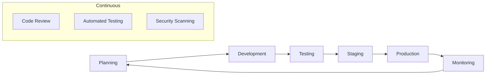

# Этапы и вехи Universo Platformo

## Краткое описание

Детальное планирование релизов и ключевых вех развития Universo Platformo от текущего Alpha статуса до полнофункциональной микросервисной платформы с интеграцией блокчейна TON.

## Содержание

- [Обзор релизного цикла](#обзор-релизного-цикла)
- [Ближайшие релизы](#ближайшие-релизы)
- [Долгосрочные цели](#долгосрочные-цели)
- [Критерии готовности](#критерии-готовности)
- [Управление релизами](#управление-релизами)

## Обзор релизного цикла

### Стратегия релизов

Universo Platformo следует **семантическому версионированию** (SemVer) с адаптацией для игровых проектов:

- **Major версии** (1.0.0, 2.0.0): Кардинальные изменения архитектуры
- **Minor версии** (0.22.0, 0.25.0): Новые функции и приложения
- **Patch версии** (0.21.1, 0.21.2): Исправления багов и мелкие улучшения

### Цикл разработки

### Каденция релизов

- **Alpha релизы**: Каждые 6-8 недель
- **Beta релизы**: Каждые 12-16 недель
- **Stable релизы**: Каждые 24-32 недели
- **Hotfix релизы**: По необходимости (критические баги)

## Ближайшие релизы

### v0.22.0-alpha "Genesis MVP" - Q2 2025

**Дата релиза**: Июнь 2025
**Фокус**: Базовые игровые механики Universo MMOOMM

#### Новые приложения
- ✅ **resources-frt/srv**: Система ресурсов с плотностью материалов
- ✅ **ships-frt/srv**: Управление кораблями и флотом
- ✅ **economy-frt/srv**: Базовая экономика с валютой Inmo

#### Ключевые функции
- 16 типов материалов с реалистичной физикой
- Система инвентаря с весом/объемом
- Базовое управление кораблями
- Экономика между тремя мирами (Kubio, Konkordo, Triumfo)
- Интеграция с PlayCanvas шаблоном MMOOMM

#### Технические улучшения
- Workspace пакеты для переиспользования кода
- Улучшенная система типов TypeScript
- Автоматизированное тестирование новых API
- Документация OpenAPI для всех сервисов

#### Критерии готовности
- [ ] Все новые приложения проходят интеграционные тесты
- [ ] PlayCanvas шаблон поддерживает новые механики
- [ ] API документация покрывает 100% эндпоинтов
- [ ] Производительность: < 200ms для 95% запросов
- [ ] Безопасность: Все API защищены авторизацией

### v0.25.0-beta "Social Foundation" - Q3 2025

**Дата релиза**: Сентябрь 2025
**Фокус**: Социальные системы и мультиплеер

#### Новые приложения
- 🔄 **corporations-frt/srv**: Корпорации и организации
- 🔄 **auth-enhanced-frt/srv**: Расширенная авторизация
- 🔄 **multiplayer-frt/srv**: Реальное время мультиплеер

#### Ключевые функции
- Система корпораций с иерархией ролей
- Интеграция игровых и платформенных аккаунтов
- Синхронизация игроков в реальном времени
- Корпоративные активы и финансы
- Базовая дипломатия между корпорациями

#### Технические улучшения
- Event-driven архитектура через Supabase Realtime
- Горизонтальное масштабирование сервисов
- Система мониторинга и алертов
- Автоматизированное развертывание

#### Критерии готовности
- [ ] Поддержка 100+ одновременных игроков
- [ ] Стабильная работа мультиплеера без рассинхронизации
- [ ] Система корпораций с полным функционалом
- [ ] Интегрированная авторизация работает без сбоев
- [ ] Beta качество стабильности (< 1 критический баг в неделю)

### v1.0.0 "Stable Universe" - Q4 2025

**Дата релиза**: Декабрь 2025
**Фокус**: Первый стабильный релиз с полной экосистемой

#### Новые приложения
- 🔄 **stations-frt/srv**: Космические станции и производство
- 🔄 **trading-frt/srv**: Продвинутая торговая система
- 🔄 **diplomacy-frt/srv**: Дипломатические отношения
- 🔄 **mining-frt/srv**: Промышленный лазерный майнинг

#### Ключевые функции
- Строительство и модификация станций
- Производственные цепочки
- Аукционы и торговые контракты
- Союзы, войны и переговоры
- Автоматизированный майнинг с дронами

#### Технические улучшения
- Production-ready качество всех компонентов
- Полная документация для разработчиков
- Система резервного копирования и восстановления
- Мониторинг производительности в реальном времени

#### Критерии готовности
- [ ] Поддержка 1000+ одновременных игроков
- [ ] 99.9% uptime в течение месяца
- [ ] Полная экосистема игровых механик
- [ ] Все API стабильны и задокументированы
- [ ] Успешное прохождение нагрузочных тестов

## Долгосрочные цели

### v1.5.0 "Microservices Evolution" - Q2 2026

**Фокус**: Микросервисная архитектура и рефакторинг Flowise

#### Новые приложения
- **workflow-engine-srv**: Движок выполнения Chatflow
- **node-registry-srv**: Центральный реестр узлов
- **api-gateway-srv**: Единая точка входа
- **template-engine-srv**: Система шаблонов экспорта

#### Ключевые достижения
- Полное отделение от монолитного Flowise
- Горизонтальное масштабирование всех сервисов
- Автоматическое обнаружение сервисов
- Enterprise-grade надежность

### v2.0.0 "Blockchain Integration" - Q4 2026

**Фокус**: Интеграция с блокчейном TON

#### Новые функции
- Форк блокчейна TON для Universo
- Миграция кошельков и смарт-контрактов
- Децентрализованная экономика
- NFT для уникальных игровых предметов

### v2.5.0 "Advanced Gameplay" - Q2 2027

**Фокус**: Продвинутые игровые механики

#### Новые функции
- Система PvP сражений
- Территориальные войны
- Исследование новых миров
- Система достижений и прогрессии

### v3.0.0 "Kiberplano Platform" - Q4 2027

**Фокус**: Расширение до полной Kiberplano функциональности

#### Новые возможности
- Создание любых типов приложений
- Интеграция с внешними системами
- Marketplace приложений
- Система плагинов и расширений

## Критерии готовности

### Технические критерии

#### Производительность
- **Response Time**: 95% запросов < 200ms
- **Throughput**: 1000+ RPS на сервис
- **Availability**: 99.9% uptime
- **Scalability**: Поддержка 1000+ одновременных пользователей

#### Качество кода
- **Test Coverage**: > 80% для новых функций
- **Code Quality**: Все проверки ESLint и TypeScript проходят
- **Security**: Отсутствие критических уязвимостей
- **Documentation**: 100% покрытие API документацией

#### Стабильность
- **Bug Rate**: < 1 критический баг на 1000 пользователей в месяц
- **Crash Rate**: < 0.1% сессий завершаются ошибкой
- **Data Integrity**: 100% целостность критических данных
- **Backup Recovery**: Успешное восстановление за < 1 час

### Бизнес критерии

#### Пользовательский опыт
- **User Satisfaction**: > 4.5/5 в отзывах пользователей
- **Retention Rate**: > 70% пользователей возвращаются через неделю
- **Engagement**: Средняя сессия > 30 минут
- **Support Tickets**: < 5% пользователей обращаются в поддержку

#### Функциональность
- **Feature Completeness**: 100% запланированных функций реализованы
- **Integration Testing**: Все интеграции работают стабильно
- **Cross-platform**: Поддержка всех целевых платформ
- **Accessibility**: Соответствие стандартам доступности

## Управление релизами

### Процесс релиза

#### Pre-release (2 недели до релиза)
1. **Code Freeze**: Остановка разработки новых функций
2. **Testing Phase**: Интенсивное тестирование всех компонентов
3. **Documentation**: Обновление документации и release notes
4. **Staging Deployment**: Развертывание на staging окружении

#### Release Day
1. **Final Testing**: Последние проверки на staging
2. **Production Deployment**: Развертывание на production
3. **Monitoring**: Интенсивный мониторинг первые 24 часа
4. **Communication**: Уведомление пользователей о новых функциях

#### Post-release (1 неделя после релиза)
1. **Bug Monitoring**: Отслеживание новых багов
2. **Performance Analysis**: Анализ производительности
3. **User Feedback**: Сбор отзывов пользователей
4. **Hotfix Planning**: Планирование критических исправлений

### Rollback Strategy

#### Автоматический откат
- Критические ошибки (5xx > 5%)
- Время отклика > 1000ms для 50% запросов
- Недоступность базы данных > 30 секунд

#### Ручной откат
- Обнаружение критических багов
- Проблемы с безопасностью
- Негативная реакция пользователей

### Communication Plan

#### Внутренняя коммуникация
- **Daily Standups**: Ежедневные обновления статуса
- **Weekly Reviews**: Еженедельный обзор прогресса
- **Release Planning**: Планирование каждые 2 недели
- **Retrospectives**: Ретроспективы после каждого релиза

#### Внешняя коммуникация
- **Release Notes**: Детальное описание изменений
- **Blog Posts**: Статьи о новых функциях
- **Social Media**: Анонсы в социальных сетях
- **Developer Updates**: Обновления для разработчиков

## Связанные страницы

- [v0.22.0-alpha](v0.22.0-alpha.md)
- [v0.25.0-beta](v0.25.0-beta.md)
- [v1.0.0-release](v1.0.0-release.md)
- [Будущие версии](future-versions.md)
- [План реализации](../implementation-plan/README.md)

## Статус планирования

- [x] Определение стратегии релизов
- [x] Планирование ближайших версий
- [x] Критерии готовности
- [x] Процессы управления релизами
- [/] Детализация долгосрочных целей
- [ ] Создание автоматизации релизов

---
*Последнее обновление: 5 августа 2025*
