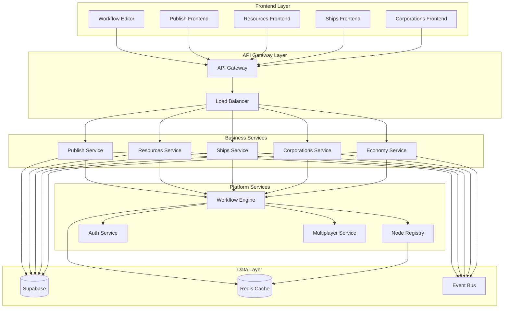

# Целевая архитектура Universo Platformo

## Краткое описание

Описание целевой микросервисной архитектуры Universo Platformo, состоящей из 20+ независимых приложений для создания полнофункционального Universo MMOOMM и расширенной платформы разработки 3D/AR/VR приложений.

## Содержание

-   [Обзор целевой архитектуры](#обзор-целевой-архитектуры)
-   [Категории приложений](#категории-приложений)
-   [Микросервисный дизайн](#микросервисный-дизайн)
-   [Стратегия оркестрации](#стратегия-оркестрации)
-   [Технологический стек](#технологический-стек)

## Обзор целевой архитектуры

### Архитектурное видение

Переход от монолитной архитектуры к распределенной экосистеме микросервисов, где каждое приложение отвечает за конкретную область функциональности и может развиваться независимо.

### Ключевые принципы

1. **Микросервисная архитектура**: Каждое приложение как независимый сервис
2. **API-first подход**: Все взаимодействия через четко определенные API
3. **Event-driven архитектура**: Асинхронная связь через Event Bus
4. **Domain-driven design**: Разделение по доменам бизнес-логики
5. **Горизонтальное масштабирование**: Независимое масштабирование сервисов

### Общая схема архитектуры



## Категории приложений

### 1. Игровые механики (8 приложений)

Приложения, реализующие основные игровые механики Universo MMOOMM:

#### Resources Management

-   **resources-frontend**: Фронтенд управления ресурсами
-   **resources-backend**: Бэкенд системы ресурсов с плотностью материалов

#### Economy System

-   **economy-frontend**: Фронтенд экономической системы
-   **economy-backend**: Бэкенд валюты Inmo и торговых операций

#### Ships & Navigation

-   **ships-frontend**: Фронтенд управления кораблями
-   **ships-backend**: Бэкенд флота и кастомизации кораблей
-   **navigation-frontend**: Фронтенд навигации между мирами
-   **navigation-backend**: Бэкенд звездных врат и картографии

#### Stations & Mining

-   **stations-frontend**: Фронтенд космических станций
-   **stations-backend**: Бэкенд строительства и производства
-   **mining-frontend**: Фронтенд промышленного майнинга
-   **mining-backend**: Бэкенд лазерных систем и дронов

### 2. Социальные системы (6 приложений)

Приложения для взаимодействия игроков и организаций:

#### Corporations & Organizations

-   **corporations-frontend**: Фронтенд корпораций
-   **corporations-backend**: Бэкенд организаций и иерархии ролей

#### Diplomacy & Relations

-   **diplomacy-frontend**: Фронтенд дипломатических отношений
-   **diplomacy-backend**: Бэкенд союзов, конфликтов и переговоров

#### Trading & Commerce

-   **trading-frontend**: Фронтенд торговых операций
-   **trading-backend**: Бэкенд аукционов, контрактов и логистики

#### Communication & Social

-   **communication-frontend**: Фронтенд внутриигровой связи
-   **communication-backend**: Бэкенд форумов и сообществ

### 3. Технические системы (6 приложений)

Приложения для технической поддержки платформы:

#### Enhanced Authentication

-   **auth-enhanced-frontend**: Фронтенд расширенной авторизации
-   **auth-enhanced-backend**: Бэкенд интеграции игровых и платформенных аккаунтов

#### Multiplayer & Networking

-   **multiplayer-frontend**: Фронтенд мультиплеера
-   **multiplayer-backend**: Бэкенд синхронизации в реальном времени

#### Security & Monitoring

-   **security-frontend**: Фронтенд систем безопасности
-   **security-backend**: Бэкенд защиты от читов и мониторинга

#### Enhanced Analytics

-   **analytics-enhanced-frontend**: Фронтенд расширенной аналитики
-   **analytics-enhanced-backend**: Бэкенд метрик и поведенческого анализа

#### Events & Activities

-   **events-frontend**: Фронтенд игровых событий
-   **events-backend**: Бэкенд динамических событий и мероприятий

#### Performance Monitoring

-   **monitoring-frontend**: Фронтенд мониторинга производительности
-   **monitoring-backend**: Бэкенд системного мониторинга и алертов

### 4. Платформенные приложения (4 приложения)

Приложения для рефакторинга функциональности Flowise:

#### Workflow Engine

-   **workflow-engine-backend**: Движок выполнения Chatflow и обработки узлов

#### Node Registry

-   **node-registry-backend**: Центральный реестр всех типов узлов с версионированием

#### Template Engine

-   **template-engine-backend**: Система шаблонов экспорта и генерации кода

#### API Gateway

-   **api-gateway-backend**: Единая точка входа, маршрутизация и авторизация

## Микросервисный дизайн

### Принципы проектирования сервисов

1. **Single Responsibility**: Каждый сервис отвечает за одну область
2. **Database per Service**: Каждый сервис имеет свою схему данных
3. **API Contracts**: Четко определенные интерфейсы между сервисами
4. **Stateless Design**: Сервисы не хранят состояние между запросами
5. **Fault Tolerance**: Graceful degradation при отказе зависимостей

### Паттерны взаимодействия

#### Синхронное взаимодействие (REST API)

```typescript
interface ServiceRequest {
    service: string
    endpoint: string
    method: 'GET' | 'POST' | 'PUT' | 'DELETE'
    data?: any
    headers?: Record<string, string>
    timeout?: number
}

interface ServiceResponse<T> {
    success: boolean
    data?: T
    error?: string
    metadata?: {
        requestId: string
        timestamp: number
        service: string
    }
}
```

#### Асинхронное взаимодействие (Event Bus)

```typescript
interface GameEvent {
    type: string
    source: string
    target?: string
    data: any
    timestamp: number
    correlationId: string
    version: string
}

interface EventHandler {
    eventType: string
    handler: (event: GameEvent) => Promise<void>
    retryPolicy?: RetryPolicy
}
```

### Схема данных

#### Разделение по доменам

```sql
-- Игровые ресурсы
CREATE SCHEMA universo_resources;
CREATE TABLE universo_resources.materials (...);
CREATE TABLE universo_resources.inventory (...);

-- Корабли и флот
CREATE SCHEMA universo_ships;
CREATE TABLE universo_ships.ships (...);
CREATE TABLE universo_ships.configurations (...);

-- Корпорации
CREATE SCHEMA universo_corporations;
CREATE TABLE universo_corporations.organizations (...);
CREATE TABLE universo_corporations.members (...);
```

#### Row Level Security (RLS)

```sql
-- Игроки видят только свои ресурсы
CREATE POLICY "players_own_resources" ON universo_resources.inventory
    FOR ALL USING (player_id = auth.uid());

-- Члены корпорации видят корпоративные данные
CREATE POLICY "corporation_members_access" ON universo_ships.ships
    FOR SELECT USING (
        player_id IN (
            SELECT player_id FROM universo_corporations.members
            WHERE corporation_id = get_player_corporation(auth.uid())
        )
    );
```

## Модель ресурсов и сущностей (ECS)

В основе игровой модели лежат два слоя:

-   **Ресурсы** — каталог типов (чертежи) с версионированием и составом (BOM)
-   **Сущности (Entity)** — инстансы ресурсов в мирах, построенные по **ECS** (Entity + Components)

Ключевые принципы:

-   Объекты создаются на основе конкретной опубликованной версии ресурса (immutable), смена версии — явная миграция
-   Entity хранит только идентичность и трансформ, прикладные данные/поведение — в компонентах
-   Состав по BOM допускает опциональные/альтернативные узлы; обязательна валидация DAG (без циклов)

### Базовые схемы БД (высокоуровнево)

```sql
-- Каталог ресурсов и версий
CREATE SCHEMA resources;
CREATE TABLE resources.resource (
    id UUID PRIMARY KEY,
    key TEXT UNIQUE NOT NULL,
    name TEXT NOT NULL,
    category TEXT,
    default_unit TEXT,
    created_at TIMESTAMPTZ DEFAULT now()
);
CREATE TABLE resources.resource_version (
    id UUID PRIMARY KEY,
    resource_id UUID REFERENCES resources.resource(id) ON DELETE CASCADE,
    semver TEXT NOT NULL,
    status TEXT CHECK (status IN ('draft','published','deprecated')),
    attributes JSONB,
    mass_kg NUMERIC,
    volume_m3 NUMERIC,
    published_at TIMESTAMPTZ
);
CREATE TABLE resources.resource_bom (
    id UUID PRIMARY KEY,
    resource_version_id UUID REFERENCES resources.resource_version(id) ON DELETE CASCADE,
    child_resource_version_id UUID REFERENCES resources.resource_version(id),
    qty NUMERIC NOT NULL,
    unit TEXT NOT NULL,
    is_optional BOOLEAN DEFAULT false,
    alternative_group TEXT
);

-- ECS: сущности и компоненты
CREATE SCHEMA ecs;
CREATE TABLE ecs.entity (
    id UUID PRIMARY KEY,
    world_id UUID,
    owner_id UUID,
    resource_version_id UUID REFERENCES resources.resource_version(id),
    transform JSONB NOT NULL,
    created_at TIMESTAMPTZ DEFAULT now()
);
CREATE TABLE ecs.component (
    id UUID PRIMARY KEY,
    entity_id UUID REFERENCES ecs.entity(id) ON DELETE CASCADE,
    type TEXT NOT NULL,
    version TEXT,
    data JSONB NOT NULL
);
CREATE TABLE ecs.relation (
    parent_entity_id UUID REFERENCES ecs.entity(id) ON DELETE CASCADE,
    child_entity_id UUID REFERENCES ecs.entity(id) ON DELETE CASCADE,
    relation_type TEXT,
    PRIMARY KEY (parent_entity_id, child_entity_id)
);
```

### Ключевые события (event-driven)

-   `resource.version.published`, `resource.bom.updated`
-   `entity.created`, `entity.moved`, `entity.state.updated`
-   `entity.assembled` / `entity.decomposed` (операции сборки/разборки по BOM)

## Стратегия оркестрации

### API Gateway

**Функции**:

-   Единая точка входа для всех клиентских запросов
-   Маршрутизация на основе URL паттернов
-   Централизованная авторизация и аутентификация
-   Rate limiting и защита от DDoS
-   Мониторинг и логирование запросов

**Конфигурация маршрутизации**:

```yaml
routes:
    - path: /api/v1/resources/*
      service: resources-backend
      auth_required: true
      rate_limit: 100/minute

    - path: /api/v1/ships/*
      service: ships-backend
      auth_required: true
      rate_limit: 50/minute

    - path: /api/v1/economy/*
      service: economy-backend
      auth_required: true
      rate_limit: 200/minute
```

### Event Bus (Supabase Realtime)

**Функции**:

-   Асинхронная связь между сервисами
-   Pub/Sub паттерн для игровых событий
-   Гарантированная доставка критических событий
-   Масштабируемая обработка событий

**Типы событий**:

```typescript
// Игровые события
interface PlayerEvent {
    type: 'player.moved' | 'player.died' | 'player.joined'
    playerId: string
    worldId: string
    data: any
}

// Экономические события
interface EconomyEvent {
    type: 'trade.completed' | 'market.price_changed' | 'resource.discovered'
    data: any
}

// Системные события
interface SystemEvent {
    type: 'service.started' | 'service.stopped' | 'health.check'
    serviceId: string
    data: any
}
```

### Service Discovery

**Функции**:

-   Автоматическое обнаружение сервисов
-   Health checks и мониторинг состояния
-   Load balancing между инстансами
-   Failover и circuit breaker паттерны

**Реализация**:

```typescript
interface ServiceRegistry {
    registerService(service: ServiceInfo): Promise<void>
    discoverService(serviceName: string): Promise<ServiceInfo[]>
    healthCheck(serviceId: string): Promise<HealthStatus>
    unregisterService(serviceId: string): Promise<void>
}

interface ServiceInfo {
    id: string
    name: string
    version: string
    host: string
    port: number
    healthEndpoint: string
    metadata: Record<string, any>
}
```

## Технологический стек

### Frontend

-   **Framework**: React 18+ с TypeScript
-   **UI Library**: Material-UI v5
-   **State Management**: Redux Toolkit + RTK Query
-   **Build Tool**: Vite
-   **Testing**: Jest + React Testing Library

### Backend

-   **Runtime**: Node.js 18+ LTS
-   **Framework**: Express.js с TypeScript
-   **API Documentation**: OpenAPI 3.0 + Swagger
-   **Testing**: Jest + Supertest
-   **Process Manager**: PM2

### Database & Storage

-   **Primary Database**: Supabase (PostgreSQL)
-   **Caching**: Redis для сессий и кэширования
-   **File Storage**: Supabase Storage
-   **Search**: PostgreSQL Full-Text Search

### DevOps & Infrastructure

-   **Package Manager**: PNPM workspaces
-   **Containerization**: Docker + Docker Compose
-   **CI/CD**: GitHub Actions
-   **Monitoring**: Prometheus + Grafana
-   **Logging**: Winston + ELK Stack

### External Integrations

-   **3D Engines**: PlayCanvas, AR.js
-   **Real-time**: Supabase Realtime
-   **Authentication**: Supabase Auth
-   **Blockchain**: TON (будущая интеграция)

## Связанные страницы

-   [Приложения MMOOMM](mmoomm-apps.md)
-   [Базовые приложения платформы](core-platform-apps.md)
-   [Дизайн микросервисов](microservices-design.md)
-   [Стратегия оркестрации](orchestration-strategy.md)
-   [План реализации](../implementation-plan/README.md)

## Статус проектирования

-   [x] Определение архитектурных принципов
-   [x] Категоризация приложений
-   [x] Проектирование взаимодействий
-   [/] Детализация технических спецификаций
-   [ ] Создание прототипов

---

_Последнее обновление: 5 августа 2025_
