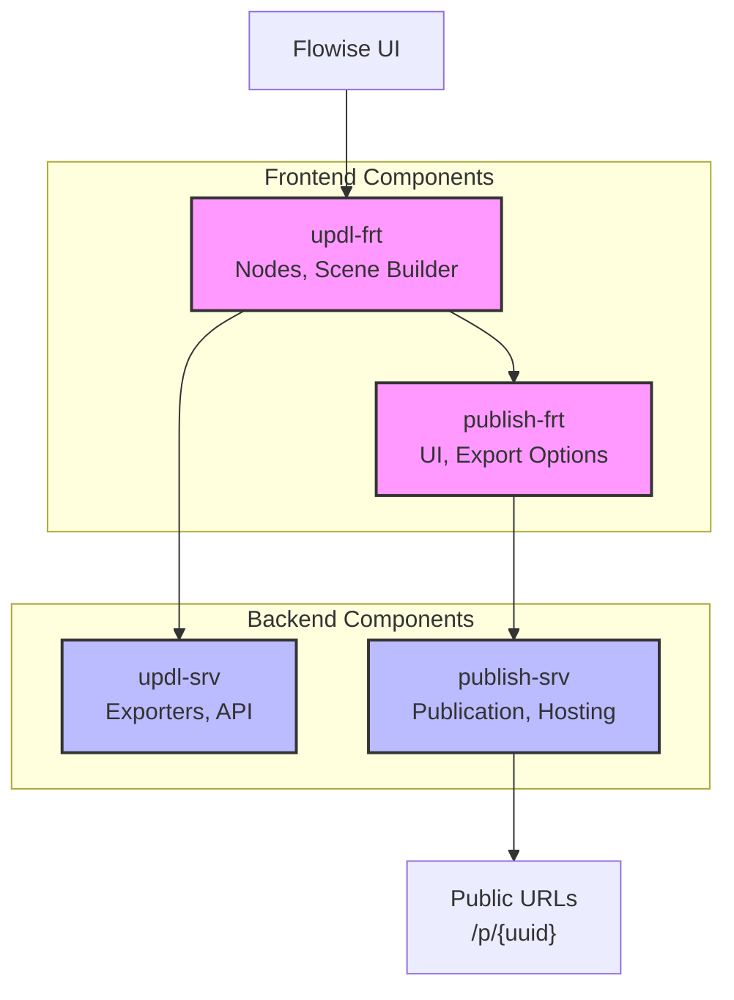

# Implementation Notes

## Project Structure Refactoring (2023-09-20)

The project has undergone significant restructuring to improve maintainability and organization. Key changes include:

### Frontend Application Structure

All frontend applications now follow a consistent directory structure:

```
apps/<app-name>/base/
├─ package.json
├─ tsconfig.json
├─ gulpfile.ts
└─ src/
   ├─ assets/              # static files (images, fonts, icons)
   │  ├─ icons/            # SVG icons for components and UI
   │  └─ images/           # Images for UI elements
   ├─ api/                 # HTTP clients to backend with clear contracts
   ├─ components/          # presentation React components
   ├─ features/            # large functional modules
   ├─ hooks/               # custom React hooks
   ├─ store/               # state management
   ├─ i18n/                # translations
   ├─ utils/               # utility functions
   ├─ interfaces/          # local TypeScript types and interfaces
   ├─ configs/             # application configurations
   └─ index.tsx            # entry point
```

### Backend Application Structure

All backend applications follow a consistent directory structure:

```
apps/<app-name>/base/
├─ package.json
├─ tsconfig.json
├─ gulpfile.ts
└─ src/
   ├─ controllers/        # Express controllers
   ├─ routes/             # route configuration (REST API)
   ├─ services/           # business logic
   ├─ models/             # data models
   ├─ interfaces/         # TypeScript types
   ├─ utils/              # helper functions
   ├─ configs/            # configurations
   ├─ middlewares/        # middleware handlers
   ├─ validators/         # input data validation
   └─ index.ts            # entry point
```

## Refactoring Notes (2023-09-25)

### Features Directory Migration

The project has completed migration from `miniapps/` to `features/` directory structure in frontend applications:

-   Technology-specific components are now organized under `features/` directory
-   Each feature has its own subdirectory with related components, utilities, and models
-   This change improves code organization and better reflects the nature of these modules

Example structure of `features/` directory:

```
features/
├─ arjs/             # AR.js specific components and logic
│  ├─ ARJSExporter.ts
│  ├─ ARJSPublisher.jsx
│  └─ models/        # Models specific to AR.js
├─ aframe/           # A-Frame components and logic
│  ├─ AFrameExporter.ts
│  └─ models/        # Models specific to A-Frame
└─ exporters/        # Common exporter components
   ├─ BaseExporter.ts
   ├─ ExporterFactory.ts
   └─ ExporterSelector.tsx
```

### API Clients

All direct imports between applications have been replaced with API client calls:

-   Frontend applications now use HTTP clients in the `api/` directory
-   These clients provide type-safe methods for calling backend APIs
-   Clear contracts between frontend and backend are defined through interfaces

## Asset Management (2023-09-30)

Assets are now organized by type in the `assets/` directory:

-   `icons/` contains SVG icons used throughout the application
-   `images/` contains larger images for UI elements
-   This separation improves clarity and makes it easier to maintain visual assets

## Build Process

The build process has been standardized across all applications:

1. TypeScript compilation via `tsc`
2. Asset copying via Gulp tasks
3. All applications can be built from the root with:

```bash
pnpm build
```

Individual applications can be built with:

```bash
pnpm build --filter="<app-name>"
```

## Other Notes

-   All new code is TypeScript-first with proper interfaces and types
-   Import paths have been updated to reflect the new structure
-   Legacy code is progressively being migrated to the new structure

## Updated Applications Architecture

We have reorganized the application structure to improve modularity and clarity:



### Application Component Responsibilities

-   **updl-frt (UPDL Frontend)**

    -   UPDL node definitions and icons
    -   Scene building functionality
    -   Client-side utilities for scene manipulation
    -   Integration with main Flowise editor

-   **updl-srv (UPDL Backend)**

    -   Exporters for various target platforms
    -   Scene validation API
    -   Backend utilities for UPDL processing
    -   Conversion services between formats

-   **publish-frt (Publish Frontend)**

    -   Publication UI components
    -   Export interface for various technologies
    -   QR code generation
    -   Preview functionality

-   **publish-srv (Publish Backend)**
    -   Storage of published projects
    -   URL generation and management
    -   API endpoints for retrieving published content
    -   Backend processing for publication requests

This separation provides several benefits:

1. Clear responsibility boundaries between components
2. Easier maintenance and independent development
3. Better isolation for testing
4. More focused codebase organization

## UPDL Integration

### Completed Steps

1. Created a separate interface file (`packages/server/src/Interface.UPDL.ts`) for UPDL-specific types:

    - Defined basic geometry interfaces (IUPDLPosition, IUPDLRotation, IUPDLColor)
    - Defined component interfaces (IUPDLObject, IUPDLCamera, IUPDLLight)
    - Defined main scene type (UPDLScene)
    - Defined flow result type (UPDLFlowResult)

2. Added UPDL interfaces export to main Interface.ts file

3. Updated buildUPDLflow.ts file:
    - Imported UPDL types
    - Removed duplicate local interface definitions
    - Added required fields to satisfy IChatFlow interface requirements

### AR.js and A-Frame Separation

Following a clear design decision, we have separated AR.js and A-Frame implementations to improve maintainability and future extensibility:

1. **File Naming Convention**:

    - Created specialized files with ARJS prefix:
        - updlToARJSBuilder.ts (replaced updlFlowBuilder.ts)
        - ARJSHTMLGenerator.ts (replaced AFrameHTMLGenerator.ts)
        - UPDLToARJS.ts (replaced UPDLToAFrame.ts)

2. **Interface Implementation**:

    - Updated ARJSPrimitive class with proper type interfaces
    - Fixed linter errors related to missing methods in ARJSPrimitive class
    - Created clear separation between UPDL core model and presentation technologies

3. **API Updates**:

    - Updated API endpoints to use consistent /arjs pattern
    - Renamed methods in UPDLController.ts (getARPublication → getARJSPublication)
    - Updated routes in updlRoutes.ts with prefix '/arjs'
    - Adapted client API to work with new routes

4. **Documentation Updates**:
    - Updated apps/publish/README.md to reflect current architecture
    - Removed outdated references to mixed AR.js/A-Frame implementations

## Publication Interface Refactoring

As part of our UI improvement initiative, we've significantly refactored the "Publish & Export" interface for AR.js technology:

1. **Component Separation**:

    - Created `ARJSExporter.jsx` as a dedicated component for HTML export functionality
    - Restructured `ARJSPublisher.jsx` to focus exclusively on publication functionality
    - Each component now has a clear, single responsibility

2. **UI Restructuring**:

    - Transformed the nested tabs system in ARJSPublisher into a single scrollable page
    - Created a dedicated "Export" tab in the main tab structure
    - Improved responsive design for better mobile experience
    - Enhanced marker selection and preview functionality

3. **Localization Improvements**:

    - Restructured i18n keys to better organize translations
    - Created proper nested structure for publication-related keys
    - Fixed issues with missing translations by adding required keys
    - Improved translation namespace usage with direct `useTranslation('publish')` instead of keyPrefix approach

4. **Integration with APICodeDialog**:
    - Updated tab rendering logic to include the new Export tab
    - Added conditional logic to show tab only for non-chatbot modes
    - Fixed component instantiation and property passing
    - Ensured proper error handling and fallback rendering

The refactored interface provides a better user experience with clear separation between publishing and exporting functionality. Users can now easily navigate between tabs and access all features without dealing with nested navigation.

### Outstanding Issues

1. **Type compatibility issues**: buildUPDLflow.ts still has linter errors related to:

    - Incompatibility between simplified objects and full Flowise interfaces
    - Missing required properties for IExecuteFlowParams

2. **Integration approach decisions**:
    - Current approach: UPDL functionality exists as specialized modules within apps directory
    - AR.js implementation is our current focus, with A-Frame VR postponed for future sprints

### Next Steps

1. **Fix remaining linter errors**:

    - Fully implement required interfaces or create proper type assertions
    - Consider mock objects for testing vs production implementation

2. **Implementation plan**:
    - Complete publication UI updates for AR.js ✅
    - Implement QR code display for mobile access ✅
    - Test publication with the marker.html example (red cube on Hiro marker)
    - Document full AR.js publication workflow

## Architecture Considerations

Creating separate interface files for domain-specific functionality (like UPDL and AR.js) provides a clean separation of concerns, making the codebase more maintainable. This approach allows us to extend functionality without cluttering the core interfaces.

Our current architecture uses the following approach:

1. Specialized implementation with clear separation between AR.js and A-Frame
2. Core UPDL features in apps/updl with minimal dependencies on Flowise
3. Publication functionality in apps/publish with RESTful API endpoints
4. Clear component separation with single responsibility principle
5. Improved localization with proper namespace structure

This balances development speed, maintainability, and future extensibility requirements, allowing us to focus on completing the AR.js implementation now while providing a clear path for future technologies.
